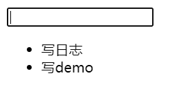
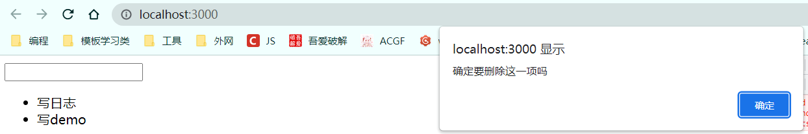
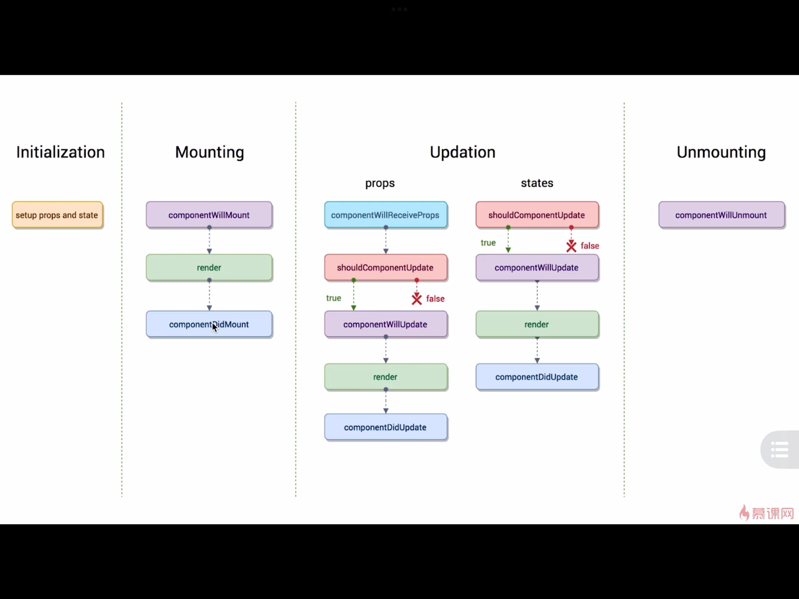
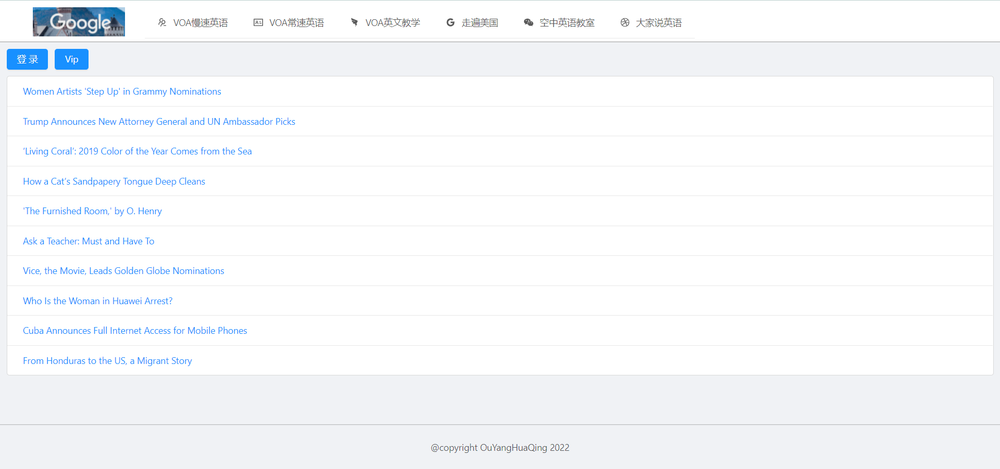
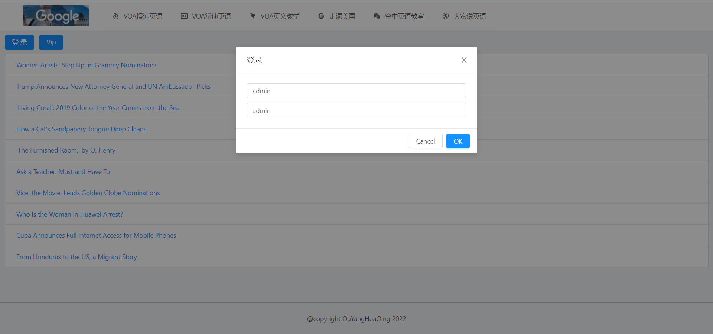
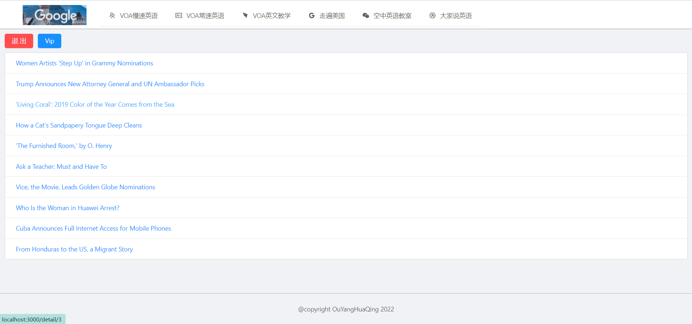

# 2022/5/3

#### 1.实现`TodoList`

react顾名思义即响应式，数据发生变化视图也跟着变化，热加载，不再需要去操作`dom`节点，关注数据的变化




###### 主要实现细节：

1.获取输入框的值，通过为input标签设置value属性，将value属性自定义为`inputValue`

2.按下enter键添加待办，enter键的ASCII码值为13，给input标签添加`onKeyUp`属性写相应的事件

3.点击对应的事项删除待办，添加`onClick`事件书写对应逻辑，主要为获取指定待办事项（数组的index属性），其次为splice（index，1）方法。**需要注意的点是不要对原数组进行操作，可以新创建一个数组对这个数组进行操作再赋值给原数组，这样不容易出现问题**

```js
// enter添加待办
handleKeyUp = (e) => {
    if (e.keyCode === 13) {
        // 拷贝list的内容到newList中去,并在最后添加一项
        const newList = [...this.state.list, this.state.inputValue];
        this.setState({
        list: newList,
        // 回车添加事件后使输入框内容为空
        inputValue: ''
        })
    }
}
```


#### 2.组建的拆分与组件之间的传值

子组件通过`this.props`的属性，从父组件接收传递过来的值

子组件想要和父组件通信，他要调用父组件传递过来的方法

------

# 2022/5/4

#### 1.`React`的核心特性

- 声明式开发
- 可以与其他框架并存（挂载在root节点下，与`html`文件中其他标签没有关系）
- 组件化
- 单向数据流（父组件可以改变子组件的数据，但是子组件**一定不能直接改变**父组件的数据）
- 函数式编程（组件里很多逻辑是靠编写函数实现，可维护性较高，还有便于前端自动化测试）


#### 2.`Props`，`State`与`render`函数

props指的是属性，父组件通过属性向子组件传递参数，state指的是组件里自己的数据即状态，render函数用于渲染页面

当组件初次创建的时候，render函数会被执行一次

当state数据发生变更的时候，render函数会被重新执行

当props数据发生变更的时候，render函数会被重新执行


#### 3.`React`中的生命周期函数

生命周期函数指的是组件在某一时刻会**自动执行**的函数

例如constructor函数，会自动执行，但不是React独有的，render函数是



Mounting即页面挂载

```js
// componentDidMount配合axios实现远程数据请求
componentDidMount() {
    const promise = axios.get('http://www.dell-lee.com/react/api/demo.json')
    promise.then((res)=>{
        console.log(res.data)
    })
}
```


#### 4.`Ant Design`组件库的使用

按官网提示操作


#### 5.`React`中的前端路由

路由即根据不同的url展示不同的页面内容,`React`中即展示不同的组件

```js
<BrowserRouter>
    <div>
        <Route path='/todoList' component={TodoList}/>
        <Route path='/counter' component={Counter}/>
    </div>
    {/*Link的作用相当于a标签，可以实现各页面之间的跳转，Link to=''*/}
</BrowserRouter>
```

需要注意的一点是：如果有多个路由，需要使用一个`<div>`标签包裹起来


------

# 2022/5/5

## 新闻展示项目





点击登录按钮时，会弹出一个对话框（`antdesign`组件库，一些button，列表，布局基本都使用的这个组件库中的一些组件），输入用户名和密码可以成功登录。登录成功后可以访问`Vip`的内容，同时登录按钮转变为红色的退出按钮



点击列表中的内容时，会显示内容详情


此处有一个bug，不能显示后端返回的图片

```js
<div 
    className='detail' 
    dangerouslySetInnerHTML={{__html:this.state.content}}>
</div>
```

使用的是`dangerouslySetInnerHTML`

#### 实现的部分重要逻辑和难点

- 各个页面之间的跳转，动态路由

  ```js
  <Switch>
      {/*匹配到相应路径之后就不再往下匹配了*/}
      <Route path='/vip' component={Vip}/>
      <Route path='/detail/:id' component={Detail}/>
      {/*通过设置路由参数跳转到不同页面*/}
      <Route path='/:id?' component={List}/>
  </Switch>
  ```

- 最外层需要一个`BrowserRouter`标签，以便使用`Link`标签跳转

- 点击图片回到根路径的逻辑

  ```js
  {/*点击图片回到根路径*/}
  <Link to='./'>
  	
  </Link>
  ```

  在React中使用图片有两种方式，一是像引入组件一样使用，二是在`img`标签中使用`require`

- 根据点击不同的详情页展示不同的内容

  ```js
  componentWillReceiveProps(nextProps) {
      // console.log(nextProps.match.params.id)
      const id = nextProps.match.params.id;
      let url = 'http://www.dell-lee.com/react/api/list.json'
      if (id) {
          url = url + '?id=' + id
      }
      // 当不传id参数时，直接请求url，不带任何参数
      axios.get(url)
          .then((res) => {
              this.setState({
                  data: res.data.data
              });
          })
  }
  ```

- 在`URL`中传递参数，使用到模板字符串

  ```js
  {/*传递id参数，使用到模板字符串*/}
  <Link to={`./detail/${item.id}`}>
      {item.title}
  </Link>
  ```

- 兄弟组件之间的传值，这里我使用到的是一个`eventBus`组件,首先在外部书写一个`event.js`文件

  ```js
  import { EventEmitter } from "events"
  // 导入事件总线,利用这个对象发射和监听事件,这个对象是全局的
  const eventBus = new EventEmitter()
  export default eventBus;
  ```

在传递参数的组件里书写一个方法，传递需要传的值和事件名，这个方法需要绑定到一个事件上去，否则不会执行

```js
send = () => {
    const login = this.state.login
    // 发送事件eventBus.emit('事件名', 参数1, 参数2)
    console.log("fasong",login)
    eventBus.emit('isLogin', login)
}
```

在接收值的组件的`componentDidMount`生命周期函数里监听这个传过来的事件

```js
eventBus.addListener('isLogin', this.isLogin)
console.log(this.state.login)
```

最后需要移除一下事件监听

```js
// 移除事件监听
componentWillUnmount() {
    eventBus.removeListener('isLogin', this.isLogin)
}
```

------

# React+Ts打造旅游电商平台

# 2022/5/7

一、创建React-Ts项目

```
npx create-react-app my-app-ts --template typescript
```

[`npx`命令详解](https://blog.csdn.net/weixin_41229588/article/details/106563430?ops_request_misc=%257B%2522request%255Fid%2522%253A%2522165189268016781683979969%2522%252C%2522scm%2522%253A%252220140713.130102334..%2522%257D&request_id=165189268016781683979969&biz_id=0&utm_medium=distribute.pc_search_result.none-task-blog-2~all~top_click~default-1-106563430-null-null.142^v9^pc_search_result_control_group,157^v4^control&utm_term=npx&spm=1018.2226.3001.4187)

​	`tsconfig.json`文件详解

```json
{
  "compilerOptions": {
    "noImplicitAny": false,    // 不需要显示地生命变量的类型为any，主要体现在函数的参数上
    "target": "es5",    // 编译后目标javascript版本
    "lib": [       // 编译器所有需要包括进来的库文件，例如可以使用dom库的document.getElementById("root")
      "dom",
      "dom.iterable",
      "esnext"
    ],
    "allowJs": true,    // 允许混合编译JavaScript文件
    "skipLibCheck": true,
    "esModuleInterop": true,   // 允许使用commonjs(即普通js引入方式)的方式import默认文件
    "allowSyntheticDefaultImports": true,
    "strict": true,
    "forceConsistentCasingInFileNames": true,
    "noFallthroughCasesInSwitch": true,
    "module": "esnext",  // 配置的是我们代码的模块系统，常见的有Node.js的commonjs、ES6标准的esnext、require
    "moduleResolution": "node",  // 决定了我们编译器的工作方式
    "resolveJsonModule": true,
    "isolatedModules": true,  // 编译器会讲每个文件作为单独的模块来使用
    "noEmit": true,  // 表示当发生错误的时候，编译器不要生成JavaScript代码
    "jsx": "react"  // 允许编译器支持编译react代码
  },
  "include": [
    "src"
  ]
}
```

#### 二、小项目：机器人画廊（robot-gallery）

##### 2.1 开发流程

需求分析——>页面布局——>生命周期——>架构设计——>全局状态

##### 2.2 `JSX`相关

`JSX`并不是标准的`Js`语法，React也并不强制使用`JSX`，也可以使用原生`JavaScript`。但`React`认为视图的本质就是**渲染逻辑与`UI`视图表现的内在统一**，把`HTML`与渲染逻辑进行耦合，便形成了`JSX`

##### 2.3 模块化CSS

每个jsx或者tsx文件就被视为一个独立存在的原件，原件所包含的内容都应该是独立存在的
